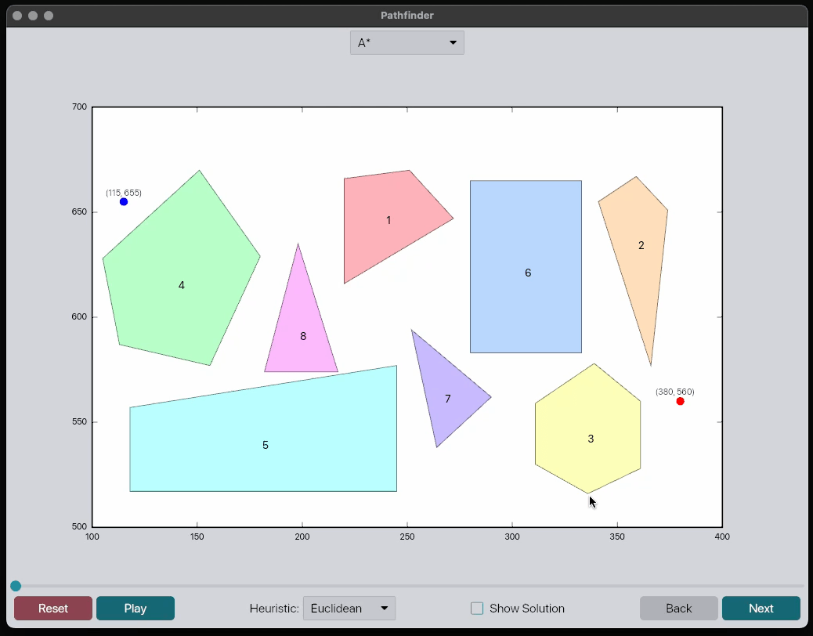

<div align="center">

# Pathfinder

Interactive pathfinding visualization demonstrating optimal path discovery around polygonal obstacles.


[](https://github.com/iced-rs/iced)

  

</div>

## Installation

> Note: You will need the Rust toolchain installed. You can install it by following the instructions at [rustup.rs](https://rustup.rs/).

```bash
# Clone the repository, build and run
git clone https://github.com/airstrike/pathfinder
cd pathfinder
cargo run --release
```

## Overview

Pathfinder is built in Rust using the [`iced`](https://iced.rs) GUI framework.
The application visualizes the A* pathfinding algorithm as it discovers optimal
paths between start and goal points while avoiding polygonal obstacles.

### Code Structure

The codebase is organized into several key modules:

- `main.rs`: Entry point containing the application state and UI event handling.
Manages the visualization loop and user interactions through the Iced framework.

- `board.rs`: Defines the game board and its polygonal obstacles. Handles
drawing the board, managing coordinate systems, and providing interfaces to
query board state (vertices, edges, etc.).

- `polygon.rs`: Implements polygon representation and geometric operations.
Handles collision detection, point-in-polygon testing, edge intersection checks,
and provides colored visualization with pastel shades. Includes comprehensive
test cases for edge cases in geometric calculations.

- `search.rs`: Implements the A* pathfinding algorithm. Maintains search state,
processes steps, and builds visibility graphs. The search uses a binary heap for
efficient frontier exploration and caches intermediate states for visualization.

### Algorithms

#### Pathfinding Implementation

The A* implementation uses a visibility graph approach for pathfinding:

1. First builds a visibility graph connecting all vertices that have line-of-sight to each other
2. Performs A* search on this graph using either Euclidean or Manhattan distance heuristics
3. Maintains search state history for visualization of the discovery process

#### Collision Detection

Edge intersection checking is handled through several geometric algorithms:

- Point-in-polygon testing using ray casting
- Line segment intersection testing using orientation predicates
- Special case handling for vertices and edges to avoid floating point precision issues

#### Obstacle Avoidance

The visibility graph ensures paths never cross through obstacles by:

1. Pre-computing valid paths between visible vertices
2. Only allowing movements along edges in the visibility graph
3. Testing all potential path segments against polygon edges during graph construction

## TODOs

If I had infinite free time, I'd implement some or all of the below. The current
code base makes some of these quite straightforward to implement, so if anyone's
up for it and submits a PR with tests, I'd be happy to merge it.

- [ ] Add support for custom boards
- [ ] Add support for custom obstacle placement
- [ ] Add support for custom start and goal placement
- [ ] Implement additional visualization modes (e.g., heatmaps, path cost, etc.)
- [ ] Add support for additional pathfinding algorithms (Dijkstra, BFS, etc.)

## Interface

`iced` provides a very helpful `Canvas` widget which we use for rendering, as
well as interactive controls such as sliders and buttons that we leverage for
detailed algorithm visualization via play/pause, step-by-step advancement, and
heuristic selection.

## Acknowledgements

- [Rust Programming Language](https://www.rust-lang.org/)
- [iced](https://iced.rs)